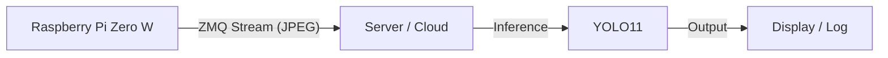

# PISTREAM

A lightweight, split-architecture motion detection and object tracking system designed for the Raspberry Pi Zero W.

## Overview

This project uses a **Split Architecture** to overcome the limited processing power of the Raspberry Pi Zero W.
*   **Edge (Raspberry Pi)**: Captures video and streams it efficiently over the network.
*   **Server (PC/Cloud)**: Receives the stream and performs heavy-duty object detection using YOLO11.

## Architecture



### Components

*   **`pi_stream.py`**: Runs on the Raspberry Pi. Uses `Picamera2` to capture video and `ZMQ` to stream JPEG frames.
*   **`server_inference.py`**: Runs on a powerful machine. Connects to the Pi's ZMQ stream, decodes frames, and runs YOLO11 tracking.
*   **`mock_stream.py`**: A utility for testing. Mimics the Pi's ZMQ stream (from webcam, file, or noise).

## Installation

We use `uv` for fast dependency management.

1.  **Clone the reposi**Options:**
*   `--headless`: Run without a GUI window (useful for cloud/headless servers).
*   `--model`: Specify a different YOLO model (default: `yolo11n.pt`).v
    source .venv/bin/activate
    uv pip install -r requirements.txt
    ```

## Configuration

Create a `.env` file in the project directory with the following variables:

```env
PORT=5555
PI_IP=<IP_ADDRESS_OF_PI>
# Optional Configuration
# Task: detect, segment, pose, classify, track
TASK=detect
# Model: yolo11n.pt, yolo11n-seg.pt, yolo11n-pose.pt, yolo11n-cls.pt
MODEL=yolo11n.pt
HEADLESS=False
MOCK_SOURCE=0
```

## Usage

### 1. Start the Streamer (Edge)

**On the Raspberry Pi:**
Transfer `pi_stream.py`, `requirements-pi.txt`, and your `.env` file to the Pi.

Install dependencies:
```bash
pip install -r requirements-pi.txt
```
*Note: `picamera2` is usually pre-installed on Raspberry Pi OS. If not, install via `sudo apt install python3-picamera2`.*

Run the streamer:
```bash
python3 pi_stream.py
```

**Local Testing (Mock):**
To simulate a stream (configure source in `.env`):
```bash
python3 mock_stream.py
```

### 2. Start the Inference Server

**On your Server/Mac:**
Ensure your `.env` file has the correct `PI_IP`.

```bash
python3 server_inference.py
```
*   `--model`: Specify a different YOLO model (default: `yolo11n.pt`).

## Supported Tasks

You can switch between different computer vision tasks by setting the `TASK` variable in your `.env` file.

| Task | Description | Recommended Model |
| :--- | :--- | :--- |
| `detect` | Object Detection (Bounding Boxes) | `yolo11n.pt` |
| `segment` | Instance Segmentation (Masks) | `yolo11n-seg.pt` |
| `pose` | Pose Estimation (Keypoints) | `yolo11n-pose.pt` |
| `classify` | Image Classification | `yolo11n-cls.pt` |
| `track` | Object Tracking (ID persistence) | `yolo11n.pt` (or seg/pose) |

## Development

*   **Requirements**: `ultralytics`, `opencv-python`, `zmq`, `imutils`, `lapx`, `python-dotenv`.
*   **Protocol**: ZMQ PUB/SUB pattern. Frames are JPEG encoded.

## Troubleshooting

### Pi Zero: "picam2 module not found"
Ensure you are running on a Raspberry Pi with the latest OS (Bookworm or newer) and that `libcamera` is installed and working (`libcamera-hello`).
1.  Run `sudo raspi-config`
2.  Go to **Performance Options** -> **GPU Memory**
3.  Set it to **128** (or higher)
4.  Reboot the Pi.