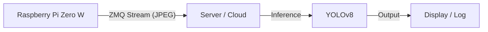

# PISTREAM

A lightweight, split-architecture motion detection and object tracking system designed for the Raspberry Pi Zero W.

## Overview

This project uses a **Split Architecture** to overcome the limited processing power of the Raspberry Pi Zero W.
*   **Edge (Raspberry Pi)**: Captures video and streams it efficiently over the network.
*   **Server (PC/Cloud)**: Receives the stream and performs heavy-duty object detection using YOLOv8.

## Architecture



### Components

*   **`pi_stream.py`**: Runs on the Raspberry Pi. Captures video from the camera, compresses it to JPEG, and streams it via ZeroMQ (TCP).
*   **`server_inference.py`**: Runs on a powerful machine. Connects to the Pi's stream, decodes frames, and runs YOLOv8 tracking.
*   **`mock_stream.py`**: A utility for testing the server without a physical Pi. Can stream from a webcam, video file, or generate noise.

## Installation

We use `uv` for fast dependency management.

1.  **Clone the repository**:
    ```bash
    git clone <repo_url>
    cd pistream
    ```

2.  **Setup Environment**:
    ```bash
    uv venv
    source .venv/bin/activate
    uv pip install -r requirements.txt
    ```

## Usage

### 1. Start the Streamer (Edge)

**On the Raspberry Pi:**
Transfer `pi_stream.py` and `requirements-pi.txt` to the Pi.

Install dependencies (minimal set for Pi Zero):
```bash
pip install -r requirements-pi.txt
```

Run the streamer:
```bash
python3 pi_stream.py --port 5555
```

**Local Testing (Mock):**
To simulate a stream from your webcam:
```bash
python3 mock_stream.py --source 0
```
To simulate with noise (no camera needed):
```bash
python3 mock_stream.py --source noise
```

### 2. Start the Inference Server

**On your Server/Mac:**
```bash
python3 server_inference.py --host <PI_IP_OR_LOCALHOST>
```

**Options:**
*   `--headless`: Run without a GUI window (useful for cloud/headless servers).
*   `--model`: Specify a different YOLO model (default: `yolov8n.pt`).

## Development

*   **Requirements**: `ultralytics`, `opencv-python`, `zmq`, `imutils`, `lapx`.
*   **Protocol**: ZMQ PUB/SUB pattern. Frames are JPEG encoded for bandwidth efficiency.